# ACI Healthcare Manpower Forecasting

End-to-end Flask application for profiling healthcare workforce data, preparing a leakage-safe daily time series, training and comparing forecasting models, and publishing future `manpower_required` predictions.

The healthcare work is maintained on the `healthcare-forecasting` branch, created from `main`.

## Current healthcare configuration

- Source workbook: `manpower_healthcare.xlsx`
- Sheet: `Sheet1`
- Source rows: 396
- Source columns: 24
- Historical period: 2025-01-01 through 2026-01-31
- Forecast target: `manpower_required`
- Target unit: staff members
- Series dimensions: `department`, then `facility_id`
- Source frequency: daily
- Default Forecast Explorer horizon: 32 days
- Default future dates for this workbook: 2026-02-01 through 2026-03-04

The trained artifact contains a longer daily forecast so users can select other supported horizons. The Forecast Explorer requests and displays 32 rows by default. Its **Future points** card is calculated from the actual returned `future_prediction` array, so the number and chart cannot disagree.

## System workflow

```mermaid
flowchart LR
    A["Upload healthcare workbook"] --> B["Map all source columns"]
    B --> C["Validate and profile data"]
    C --> D["Preprocess daily series"]
    D --> E["Engineer calendar and exogenous features"]
    E --> F["Evaluate eligible models"]
    F --> G["Refit completed models on full history"]
    G --> H["Publish owned forecast artifacts"]
    H --> I["Review leaderboard and 32-point forecast"]
    I --> J["Monitor drift and retrain"]
```



## Source-column contract

Every workbook column is read. The mapping stage assigns each column a deliberate role so no field is silently ignored.

| Source column | Pipeline role | How it is used |
|---|---|---|
| `date` | Timestamp | Sorted, validated, and converted to canonical `Date` |
| `department` | Primary series dimension | Preserves department identity and supports filtering |
| `facility_id` | Secondary series dimension | Preserves facility identity and supports filtering |
| `facility_name` | Context | Retained in raw preview and lineage |
| `city` | Context | Retained in raw preview and lineage |
| `state` | Context | Retained in raw preview and lineage |
| `day_of_week` | Exogenous driver | Encoded for eligible exogenous models |
| `is_weekend` | Exogenous driver | Encoded for eligible exogenous models |
| `is_holiday` | Exogenous driver | Encoded for eligible exogenous models |
| `holiday_name` | Exogenous driver | Categorical value encoded with bounded cardinality |
| `season` | Exogenous driver | Categorical seasonal context |
| `patient_census` | Exogenous driver | Operational demand signal |
| `occupancy_rate` | Exogenous driver | Operational demand signal |
| `patient_acuity_index` | Exogenous driver | Patient-complexity signal |
| `admissions` | Exogenous driver | Patient-flow signal |
| `discharges` | Exogenous driver | Patient-flow signal |
| `total_staff_hours` | Leakage exclusion | Excluded because it reflects staffing outcomes |
| `scheduled_staff` | Leakage exclusion | Excluded because it is directly linked to staffing decisions |
| `absent_staff` | Leakage exclusion | Excluded because it reveals realized workforce availability |
| `available_staff` | Leakage exclusion | Excluded because it is contemporaneous with the target |
| `overtime_hours` | Leakage exclusion | Excluded because it is a downstream staffing response |
| `manpower_required` | Forecast target | Canonical `Click Count` training value for compatibility with the original engine |
| `data_origin` | Provenance | Retained in immutable raw data and lineage |
| `source_url` | Provenance | Retained in immutable raw data and lineage |

## Stage-by-stage pipeline

### Stage 0 — Application and session initialization

**Input:** application configuration and an empty or existing runtime directory.

**Processing:**

- Creates the upload, preprocessed, and runtime directories.
- Assigns generated state to the signed browser session.
- Optionally clears generated state at startup.
- Keeps source code and the included workbook separate from generated artifacts.

**Output:** an isolated workspace under `Data/*/sessions/<session-id>/`.

For local development, use `CLEAR_RUNTIME_ON_START=false` when a server restart must preserve the active upload and trained model artifacts.

### Stage 1 — Workbook upload and immutable raw preview

**Input:** `.xlsx`, `.csv`, `.tsv`, or `.txt`.

**Processing:**

- Reads headers without renaming the original source schema.
- Calculates source row and column counts.
- Detects likely timestamp, target, dimension, and exogenous fields.
- Stores an immutable raw preview using positional column IDs, so duplicate or Unicode headers remain addressable.

**Output:** dataset identity, raw schema, raw preview, and suggested healthcare mapping.

**UI:** Data Studio at `/dataset`.

**Quality gate:** the healthcare workbook must report 396 raw rows and 24 columns.

### Stage 2 — Mapping and column lineage

**Input:** selected timestamp, target, dimensions, and exogenous column IDs.

**Processing:**

- Maps `date` to the canonical timestamp.
- Maps `manpower_required` to the canonical target.
- Maps `department` and `facility_id` to stable dimensions.
- Classifies all remaining columns as exogenous, leakage, context, or provenance.
- Generates a row-by-row column-lineage report.

**Output:** mapping metadata and an adapted dataset contract.

**Quality gate:** every one of the 24 source columns must appear in column lineage.

### Stage 3 — EDA and data-quality analysis

This stage is the exploratory data analysis (EDA/EDF) layer.

**Processing:**

- Reports date coverage, row counts, missing values, data types, and numeric-conversion failures.
- Profiles target distribution and trend.
- Shows daily, weekly, and monthly behavior.
- Reports dimension values and filtered row counts.
- Reconciles raw, removed, aggregated, generated, and final training rows.

**Output:** `enrichment.json`, raw and processed previews, preprocessing explanation, analytics summaries, and chart-ready data.

**Quality gate:** row accounting must reconcile, and numeric target conversion failures must remain below the configured limit.

### Stage 4 — Preprocessing

**Processing:**

1. Parse and validate dates.
2. Parse `manpower_required` as numeric.
3. Remove invalid timestamp or target rows.
4. Sort by dimensions and date.
5. Aggregate duplicate series/date rows with the configured target aggregation.
6. Infer daily frequency.
7. Handle only bounded target gaps according to the configured imputation policy.
8. Create canonical columns used by the original forecasting engine.

**Output:** `cleaned_training_input.csv`.

For the included workbook, the expected result is 396 sorted daily training rows from 2025-01-01 through 2026-01-31.

### Stage 5 — Feature preparation

**Processing:**

- Generates deterministic calendar features from the forecast timestamp.
- Encodes bounded categorical exogenous fields.
- Scales or filters exogenous inputs where required by a model.
- Removes constant endogenous or exogenous columns before VAR fitting.
- Projects source exogenous drivers into the future using only trailing historical seasonal cycles; future target values are never used.

**Output:** aligned target and feature frames for each eligible model.

**Leakage rule:** staffing outcome fields remain excluded from all model features.

### Stage 6 — Model eligibility and training

The application evaluates 13 candidates and records whether each is completed, failed, or not applicable.

| Model family | Candidates |
|---|---|
| SARIMAX | Standard and exogenous |
| Auto ARIMA | Standard and exogenous |
| XGBoost | Standard and exogenous |
| Exponential Smoothing | Additive, additive damped, multiplicative, multiplicative damped |
| VAR | Standard and exogenous |
| LSTM | TensorFlow sequence model |

Expected structural non-applicability is reported separately from a true model failure. One failed candidate does not stop the remaining portfolio.

**Output:** live training status, per-model runtime, eligibility reasons, errors, and trained candidates.

**UI:** Full ML Training in Data Studio and Training Monitor at `/training-pipeline`.

### Stage 7 — Rolling-origin evaluation

**Processing:**

- Builds chronological folds without shuffling.
- Fits each candidate only on data available before each forecast origin.
- Produces historical backtest predictions.
- Calculates MAE, RMSE, MAPE, WAPE, bias, accuracy, and coverage where applicable.
- Builds empirical prediction intervals from out-of-sample residuals.
- Deduplicates overlapping fold timestamps by retaining the shortest honest forecast horizon.

**Output:** owned `backtest_predictions`, model metrics, and ranking data.

**Quality gate:** a model is ranked only when its metric is valid; unreliable or insufficient backtests are disclosed.

### Stage 8 — Full refit and future prediction

**Processing:**

- Refits every completed model on the complete cleaned history.
- Starts the forecast strictly after the last actual timestamp.
- Generates a long future artifact for supported UI horizons.
- Attaches dataset, preprocessing artifact, job, model, and series ownership to each row.
- Publishes only finite, usable future values.

**Output:** `forecast_data.json`, `forecast_manifest.json`, and future prediction intervals when available.

For this dataset:

- Last actual: 2026-01-31
- First future point: 2026-02-01
- Default requested horizon: 32 daily points
- Default forecast end: 2026-03-04

The API performs the 32-row slice. The UI then counts the returned rows, providing two independent protections against an incorrect hard-coded count.

### Stage 9 — Model selection and user review

**Model Leaderboard** at `/model-metrics` ranks valid candidates with lower error treated as better.

**Forecast Explorer** at `/forecast-explorer` provides:

- historical actuals;
- rolling-origin backtests;
- future manpower predictions;
- prediction intervals;
- department and facility filters;
- daily, weekly, and monthly views;
- a 32-day daily default;
- plain-language trend and uncertainty summaries;
- drift analysis.

**Command Center** at `/dashboard` contains KPI and operational summary cards only. The detailed actual/backtest/future, leaderboard, and confidence charts intentionally remain outside Command Center.

### Stage 10 — Drift monitoring and retraining

**Processing:**

- Compares recent and earlier target behavior.
- Evaluates residual and forecast change when those signals are available.
- Returns normalized severity, affected signal, and recommended action.

**Output:** drift status and explanation in Forecast Explorer.

Retrain after receiving new actual data, changing the mapping, changing material feature assumptions, or detecting sustained drift.

## Local setup

### Prerequisites

- Windows PowerShell
- Python 3.12
- Enough memory for TensorFlow, XGBoost, Auto ARIMA, and statsmodels

### Install

```powershell
cd "C:\Users\Vijju Babu\OneDrive - ACI INFOTECH INC\Desktop\Forecasting\Forecasting"
py -3.12 -m venv .venv
.\.venv\Scripts\python.exe -m pip install --upgrade pip
.\.venv\Scripts\python.exe -m pip install -r requirements.txt
```

### Run

```powershell
$env:CLEAR_RUNTIME_ON_START = "false"
$env:PYTHONDONTWRITEBYTECODE = "1"
.\.venv\Scripts\python.exe app.py
```

Open `http://127.0.0.1:5000`.

### Run the workflow

1. Open **Data Studio**.
2. Upload `manpower_healthcare.xlsx`.
3. Review the suggested mapping and all-column lineage.
4. Apply the mapping.
5. Review EDA, data quality, row accounting, and processed preview.
6. Select **Train Full ML Models**.
7. Wait for a terminal status.
8. Open **Model Leaderboard** to review ranked candidates.
9. Open **Forecast Explorer**.
10. Confirm **32 days** is selected and **Future points** shows **32**.

## Main pages and APIs

| Route | Purpose |
|---|---|
| `/health` | Process health check |
| `/dataset` | Upload, mapping, EDA, preprocessing, and training launch |
| `/dashboard` | Command Center KPI summary |
| `/training-pipeline` | Training status and candidate execution details |
| `/model-metrics` | Model leaderboard |
| `/forecast-explorer` | Filtered actual, backtest, future, uncertainty, and drift view |
| `POST /dataset/upload` | Upload and inspect a source dataset |
| `POST /dataset/map` | Apply the source-to-canonical mapping |
| `POST /train` | Start background full-model training |
| `GET /training-status` | Poll the active training job |
| `GET /api/data-studio-analytics` | Return filtered EDA and preprocessing analytics |
| `GET /api/models` | Return model metrics |
| `GET /api/forecast-filters` | Return dependent dimension/model/horizon options |
| `GET /api/forecast` | Return owned historical, backtest, and future predictions |
| `GET /api/drift` | Return drift analysis for the current filter state |

Example 32-point request:

```text
GET /api/forecast?granularity=Daily&horizon_value=32&horizon_unit=days
```

Successful responses must satisfy:

```text
metadata.future_prediction_count == len(future_prediction) == 32
```

## Generated artifacts

Generated state is session-scoped.

```text
Data/
├── uploads/sessions/<session-id>/                # active raw upload
├── Preprocessed/sessions/<session-id>/
│   └── cleaned_training_input.csv                # mapped training data
└── runtime/sessions/<session-id>/
    ├── enrichment.json                           # EDA and preprocessing summary
    ├── training_status.json                      # live/terminal job state
    ├── training_log.json                         # model execution events
    ├── model_metrics.json                        # candidate metrics
    ├── forecast_data.json                        # history, backtests, future rows
    ├── forecast_manifest.json                    # publication status by model
    ├── drift.json                                # drift payload/cache
    └── kpis.json                                 # summary KPI values
```

Do not edit generated JSON by hand. Re-run mapping or training so ownership metadata remains consistent.

## Verification

### Fast healthcare mapping and EDA test

```powershell
$env:PYTHONDONTWRITEBYTECODE = "1"
.\.venv\Scripts\python.exe -B tests\test_healthcare_pipeline.py
```

### Complete real-workbook training test

This test trains the full model portfolio and verifies that the API returns exactly 32 future points.

```powershell
$env:PYTHONDONTWRITEBYTECODE = "1"
.\.venv\Scripts\python.exe -B tests\test_healthcare_pipeline.py --full
```

### All Python harnesses

```powershell
$env:PYTHONDONTWRITEBYTECODE = "1"
$tests = Get-ChildItem .\tests -Filter "test_*.py" | Sort-Object Name
foreach ($test in $tests) {
    & .\.venv\Scripts\python.exe -B $test.FullName
    if ($LASTEXITCODE -ne 0) { exit $LASTEXITCODE }
}
```

### JavaScript syntax and state test

```powershell
node --check static\js\dataset.js
node --check static\js\forecast_explorer.js
node --check static\js\model_metrics.js
node tests\test_forecast_model_state.js
```

## Configuration

| Environment variable | Default | Purpose |
|---|---:|---|
| `CLEAR_RUNTIME_ON_START` | `true` | Clears generated dataset state when the app starts |
| `FORECAST_DATA_DIR` | `Data/runtime` | Runtime JSON location |
| `FORECAST_AGGREGATION` | inferred | Overrides target aggregation |
| `FORECAST_EXOG_AGGREGATIONS` | empty | Per-exogenous aggregation overrides |
| `FORECAST_TARGET_IMPUTATION` | `auto` | Target gap strategy |
| `FORECAST_IMPUTATION_MAX_GAP` | `3` | Maximum bounded target gap |
| `FORECAST_MAX_NUMERIC_FAILURE_RATE` | `0.25` | Rejects badly parsed numeric targets |
| `FORECAST_MAX_EXOG_CATEGORIES` | `50` | Maximum categorical exogenous cardinality |
| `FORECAST_XGB_N_JOBS` | `1` | XGBoost parallel workers |
| `FORECAST_LSTM_WINDOW` | `30` | LSTM input window |
| `FORECAST_LSTM_EPOCHS` | `25` | LSTM training epochs |
| `FORECAST_LSTM_BATCH_SIZE` | `32` | LSTM batch size |
| `FORECAST_MAX_PER_SERIES_MODELS` | `250` | Maximum series receiving per-series artifacts |
| `FORECAST_PER_SERIES_MODEL_LIMIT` | `4` | Models trained per series |
| `FORECAST_SERIES_PHASE_BUDGET_SECONDS` | `300` | Per-series phase time budget |
| `FORECAST_MIN_BACKTEST_POINTS` | `5` | Minimum reliable backtest size |
| `RAW_PREVIEW_EXACT_COUNT_MAX_BYTES` | `10485760` | Exact raw count threshold for text uploads |
| `FLASK_DEBUG` | `0` | Flask debug mode |
| `SECRET_KEY` | generated | Flask session signing key |

## Troubleshooting

### Future points still shows 30

1. Confirm the **Future horizon** selector says **32 days**.
2. Restart the Flask server so the new backend horizon list is loaded.
3. Hard-refresh the page with `Ctrl+F5`.
4. Check the API request uses `horizon_value=32&horizon_unit=days`.
5. Confirm the response contains 32 `future_prediction` rows.

If the selector intentionally remains at **30 days**, the API will correctly return 30 daily rows. The count always reflects the selected horizon.

### Training completes with warnings

Review the candidate details. A structurally inapplicable model is different from a failed applicable model. Constant VAR columns are filtered, and exogenous models require usable feature frames.

### No future forecast

Confirm that training produced a generated model in `forecast_manifest.json`, that the selected model supports the requested series scope, and that the browser session owns the current dataset/job/artifact IDs.

### State disappears after restart

Set `CLEAR_RUNTIME_ON_START=false` before starting the server. The default `true` is intended for clean deployments.

## Render deployment

The repository includes `Dockerfile`, `Procfile`, and `render.yaml`.

1. Create a Render Blueprint.
2. Connect `vijju396/Timeseries_Forecast`.
3. Select the `healthcare-forecasting` branch.
4. Deploy and wait for `/health`.

Use one worker because training is performed in a background thread and generated JSON state is local to the application process. Render's free instance can run the UI but may not have enough memory for the full TensorFlow/XGBoost/Auto-ARIMA portfolio. Use a memory-sufficient instance and persistent storage for production data retention.
